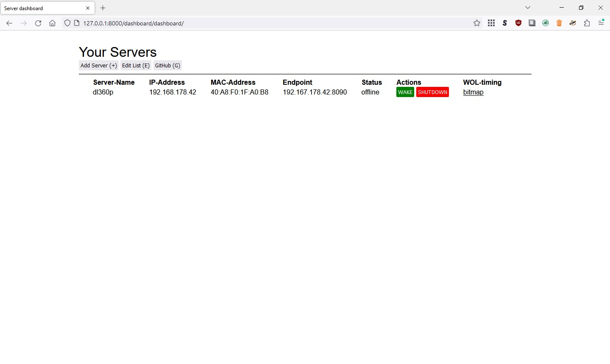
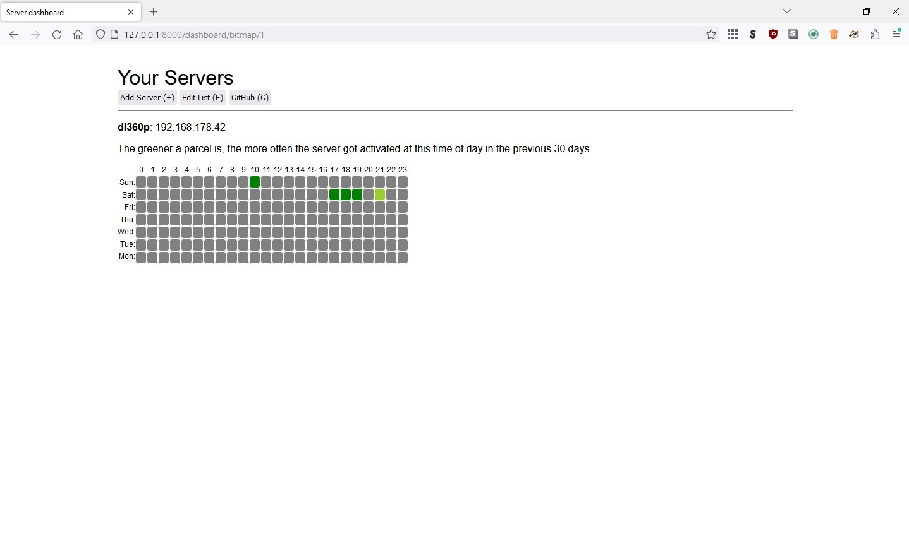

# server-dashboard
## Functionality


1. Show/Create a list of all your servers
2. Wake your Server via wake-on-lan
3. Shutdown your Server
4. Creating a heuristic from the last 30 days when your Server was woken
5. From this heuristic wake your Server before you even need it 

### Dashboard


### Heuristic displayed as bitmap


## Installation
```
name: Install dependencies
      run: |
        python3 -m pip install --upgrade pip
        pip install pylint
        pip install -r ./requirements.txt
```
git clone
```

```python
python3 manage.py makemigrations dashboard
python3 manage.py migrate
python3 manage.py crontab add
python3 manage.py runserver
```